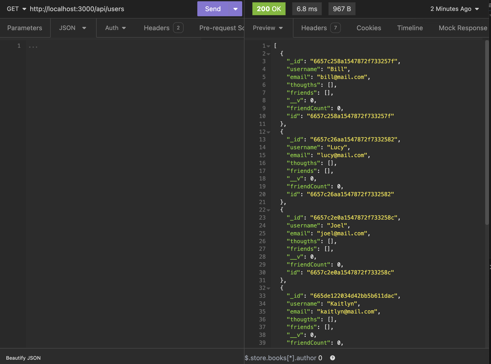
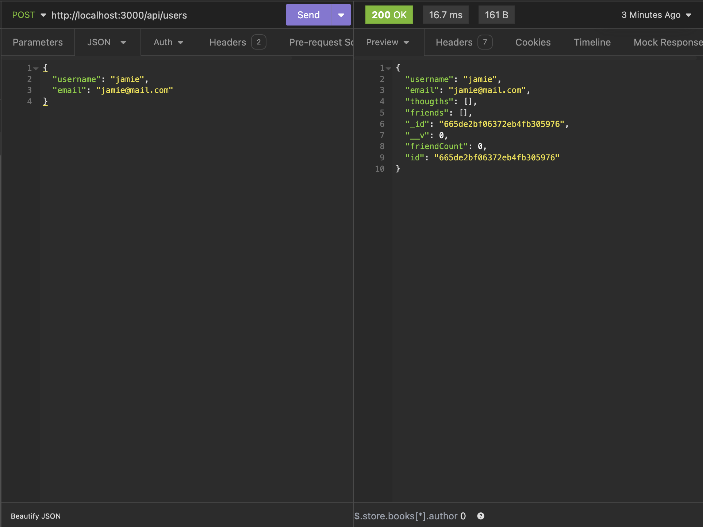
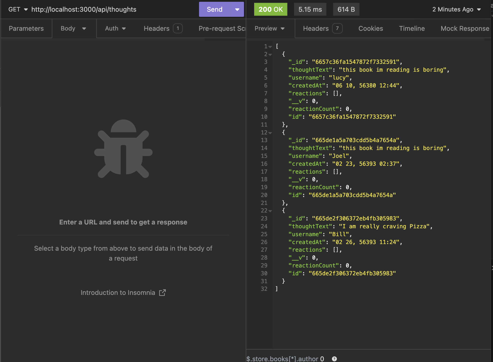
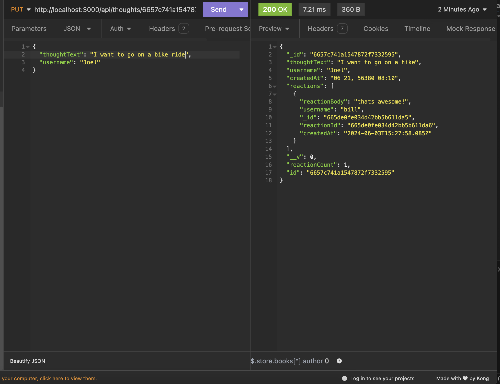

# social-network-API

  ## Description
  This application will provide a client with a API using a NoSql database so that the intended social networking website can handle unstructured data. It will track users, generate a friends list, and accept thoughts using Insomnia.

  ## Table of Contents
  1. [Installation](#installation)
  2. [Usage](#usage)
  3. [License](#license)
  4. [Contributors](#contributors)
  5. [Tests](#tests)
  6. [Contact](#contact)

  ## Installation
    npm install mongoose

  ## Usage 
  
  Here is the link to a video walkthrough: [https://drive.google.com/file/d/17yvwMy27YRZ7f_ZoeSF6D3oRZ4et6DSV/view]

  
  
  
  

  ## License
  MIT License

Copyright (c) 2024 aejantz2015

Permission is hereby granted, free of charge, to any person obtaining a copy
of this software and associated documentation files (the "Software"), to deal
in the Software without restriction, including without limitation the rights
to use, copy, modify, merge, publish, distribute, sublicense, and/or sell
copies of the Software, and to permit persons to whom the Software is
furnished to do so, subject to the following conditions:

The above copyright notice and this permission notice shall be included in all
copies or substantial portions of the Software.

THE SOFTWARE IS PROVIDED "AS IS", WITHOUT WARRANTY OF ANY KIND, EXPRESS OR
IMPLIED, INCLUDING BUT NOT LIMITED TO THE WARRANTIES OF MERCHANTABILITY,
FITNESS FOR A PARTICULAR PURPOSE AND NONINFRINGEMENT. IN NO EVENT SHALL THE
AUTHORS OR COPYRIGHT HOLDERS BE LIABLE FOR ANY CLAIM, DAMAGES OR OTHER
LIABILITY, WHETHER IN AN ACTION OF CONTRACT, TORT OR OTHERWISE, ARISING FROM,
OUT OF OR IN CONNECTION WITH THE SOFTWARE OR THE USE OR OTHER DEALINGS IN THE
SOFTWARE.

  ## Contributors
  N/A

  ## Tests
  N/A

  ## Contact
    GitHub: https://github.com/aejantz2015

    Email: aejantz2015@gmail.com